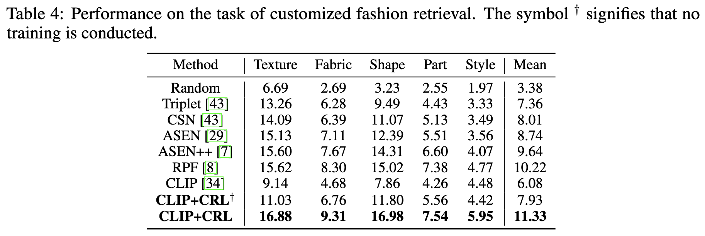

# 2025-NeurIPS-CRL

# Fashion Retrieval

## Tips

The core of our work is obtaining the conditional embedding, so we don't carefully set the parameters. If you are interested in this task, you can refer to [asen](https://github.com/Maryeon/asen) or [asen++](https://github.com/Maryeon/asenpp) and implement one with better performance by yourself.

Two things you should notice:

1. The dataloader mixes different criteria. Thus, we perform PCA on the text embedding to keep the dimension the same.
2. Most files come with their own parser for parameter configuration. You need to modify the path to your own.

In our implementation, we add an MLP layer to the output of the CLIP model. We first freeze the CLIP backbone and only finetune the MLP layer. Then we freeze the MLP layer and only finetune the backbone.

## Dataset

We adopt DeepFashion as the benchmark dataset, keeping the same as [asen](https://github.com/Maryeon/asen):

([DeepFashion](https://www.cv-foundation.org/openaccess/content_cvpr_2016/papers/Liu_DeepFashion_Powering_Robust_CVPR_2016_paper.pdf) is a large dataset which consists of four benchmarks for various tasks in the field of clothing including [category and attribute prediction](http://mmlab.ie.cuhk.edu.hk/projects/DeepFashion.html) which we use for our experiments, in-shop clothes retrieval, fashion landmark detection and consumer-to-shop clothes retrieval.)

## MLP_training

Run the following commands to obtain the image and text embeddings:

> cd mlp_training/
> 
> python image_embedding.py
> 
> python text_embedding.py

Evaluate the original CLIP model by:

> python sim_embedding.py

Train the MLP layer by:

>python train_mlp.py

Evaluate the MLP_layer by:

> python test_mlp.py

## Backbone_training

Generate the text embeddings:

> cd ../backbone_training/
> 
> python text_embedding.py

Train the CLIP backbone by:

> python mlp_fixed.py

Evaluate the final model by:

> python test_model.py

## Performance

