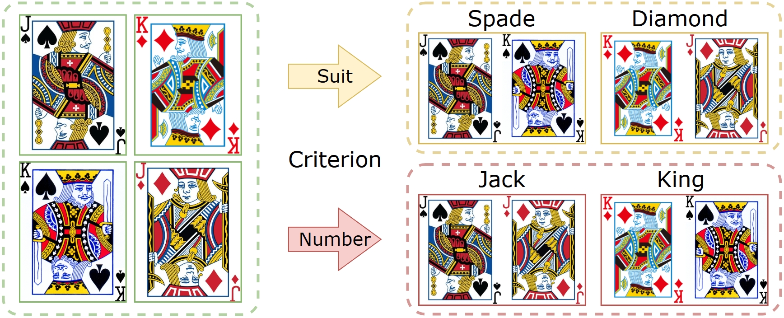
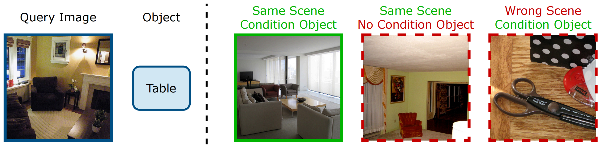
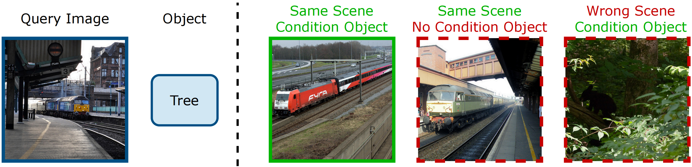
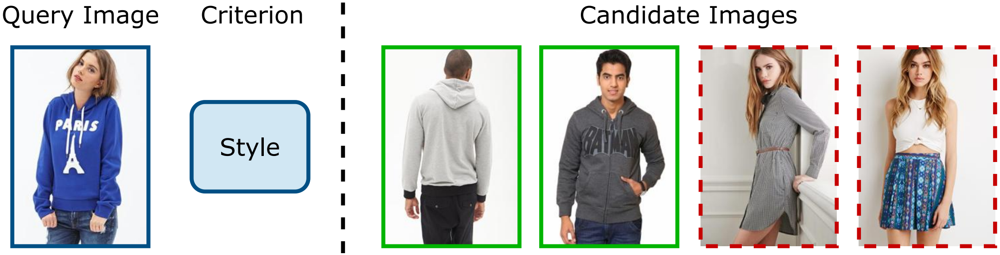

# Conditional Representation Learning for Customized Tasks
Conventional representation learning focuses on learning a universal representation based on a single criterion.

We propose conditional representation learning (CRL) towards arbitrary criteria for multiple downstream tasks.

### 🚀 A frustratingly simple yet effective way:

1. Given a criterion $C$, let LLM generate related descriptive texts.
2. Feed images and texts into the VLM to get embeddings $I$ and $T$.
3. Obtain the conditional representation $R = IT^{\top}$.
4. Apply $R$  to the downstream task.

### 🖥️ Four downstream tasks for evaluation:

We showcase the generalization ability of our method through four downstream tasks: Few-shot Classification, Clustering, Similarity Retrieval, and Fashion Retrieval. 

You can refer to the corresponding folder for the part you are interested in.

#### ❖ Few-shot Classification & Clustering

Directly use the conditional embedding to perform few-shot classification and clustering under multiple criteria.

#### ❖ Similarity Retrieval

This benchmark is proposed by [GeneCIS](https://github.com/facebookresearch/genecis/tree/main). We adopt the "Focus on an object" and "Change an object" settings.

Briefly, the “Focus” setting aims to retrieve the candidate that contains both the same scene (*e.g.*, living room) and the condition object (*e.g.*, table) as the query image. 

In contrast, the “Change" setting requires the target image to maintain the same scene (*e.g.*, railway) as the query image while including the condition object (*e.g.*, tree) that is absent in the query image.

To employ CRL, we ask the LLM for the common scenes and obtain the conditional representation of the query and candidate images, then calculate and sum the similarities of these two factors for retrieval.

#### ❖ Fashion Retrieval

This benchmark is proposed by [CSN](https://github.com/andreasveit/conditional-similarity-networks), and we adopt the DeepFashion dataset.

Briefly, given a criterion, it searches all the candidate images that share the same value as the query image.

We generate the conditional representation and apply it to this task following [ASEN](https://github.com/Maryeon/asen?tab=readme-ov-file).

### 🗒️ Citation

If you find our work helpful to you, please consider citing our paper. Thanks very much.

We sincerely hope this work could inspire new insights and stimulate further research in this underexplored yet promising field.
